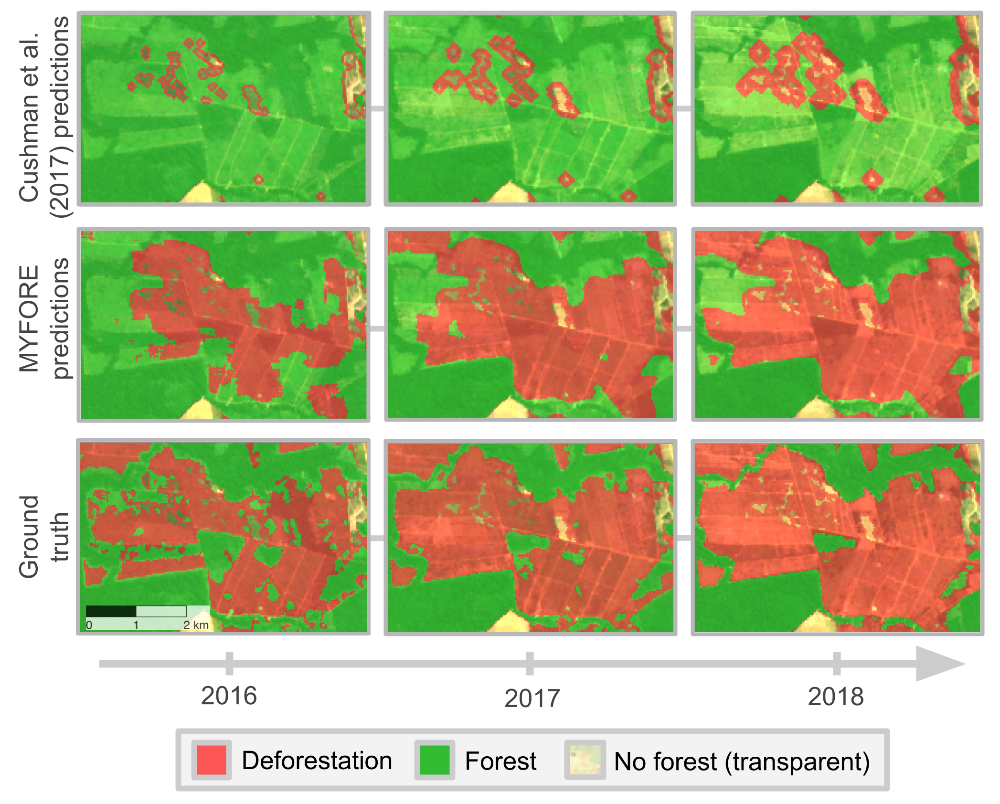

<div align="center">

# Towards high-resolution forecasting of tropical deforestation with deep learning


**Jan Jan Pišl<sup>*,1</sup>**, **Gencer Sumbul<sup>1</sup>**, **Gaston Lenczner<sup>1</sup>**, **Jan Dirk Wegner<sup>2</sup>**, **Devis Tuia<sup>1</sup>** 

<sup>1</sup> ECEO, École Polytechnique Fédérale de Lausanne (EPFL), Sion, Switzerland
<sup>2</sup> DM3L, University of Zurich, Switzerland

<sup>*</sup>Corresponding author: [Devis Tuia](mailto:devis.tuia@epfl.ch)

[](https://deforestation-forecasting.projects.earthengine.app/view/confidencethreshold)
[](https://zenodo.org/uploads/18451050)


</div>


## Repository Structure

```
config/                         
  └── sample_config.json

data/                           # Data is available in ZENODO (https://zenodo.org/uploads/18451050)
  ├── annotation.csv
  │
  ├── inputs/                   # Model inputs
  │     ├── elevation.tif
  │     ├── deforestation_maps/
  │     └── lulc/
  │
  ├── inference/                
  │     ├── inference_area.gpkg
  │     ├── municipalities_amazon_biome/    
  │     └── predictions/        # MYFORE predictions for 2016-2018
  │
  ├── models_trained/           # Selected model checkpoints and their configuration
  │     ├── 7f9gc9px/
  │     ├── b7pa58ky/
  │     ├── dndvccf8/
  │     ├── efd6ara9/
  │     └── v5kqobut/
  │
  └── results/                  # Serialized numerical results for experiments described in the manuscript
        ├── engelman_results.pkl
        ├── input_combinations.pkl
        ├── loss_fc.pkl
        ├── sequence_length.pkl
        └── temporal_generalization.pkl

notebooks/                      # Analysis and results notebooks
  ├── results-baseline-Cushman.ipynb
  ├── results-Engelman.ipynb
  ├── results-inference-analysis-by-municipality.ipynb
  ├── results-input-combinations-NYFORE.ipynb
  ├── results-multi-year-predictions-baseline-Cushman.ipynb
  ├── results-multi-year-predictions-predictions-MYFORE.ipynb
  ├── results-seq-len.ipynb
  ├── results-temporal-generalization.ipynb
  ├── supplementary-loss-function.ipynb
  └── supplementary-ranking.ipynb

src/                            
  ├── algorithm/                
  │     ├── loss.py
  │     └── models/
  │           ├── convlstmseg.py
  │           ├── get_model.py
  │           └── model_blocks.py
  │
  ├── data/                    
  │     ├── dataset.py
  │     ├── engelman.py
  │     ├── get_dataloaders.py
  │     └── inference_dataset.py
  │
  ├── scripts/                  
  │     ├── accumulate_target_rasters.py
  │     ├── engelman_extract_features.py
  │     ├── extract_random_patches.py
  │     ├── inference.py
  │     ├── multiyear_inference.py
  │     ├── multiyear_prediction.py
  │     └── multiyear_prediction_baseline.py
  │
  ├── evaluate.py               
  ├── train.py                  
  └── utils.py                  

```


